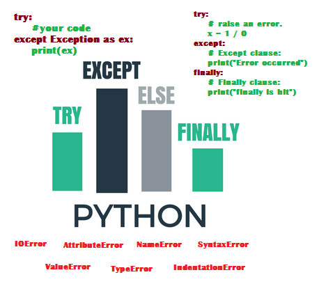
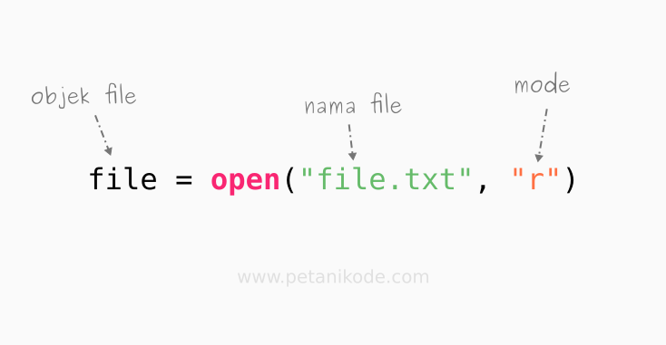

# Praktikum 9
```bash
NAMA  : Galih Pangestu
NIM   : 312210005
KELAS : TI.C1.22
```
# Exception Handling (Pengecualian)
 `Python Exception handling` adalah suatu mekanisme penanganan flow normal program karena terjadi *exception* dengan melanjutkan flow ke code block lainnya.
 
                                                        
 Kenapa harus menangani *exception?* Karena terjadi *exception* dan kita tidak tangani, maka program akan berhenti.

 Object *exception* mengandung informasi dimana dan kenapa *exception* terjadi. Jadi kita dapat melakukan tindakan tepat agar program tetap berjalan semestinya.

# Exception Handling
# Contoh Kasus
**Jalankan contoh kode di bawah, kemudian coba berikan nilai seharusnya (angka) dan bandingkan hasilnya dengan memberikan nilai yang tidak sesuai (misal: huruf)**
.png)
**Jika pada contoh di atas user memberikan nilai non angka saat diminta, maka program akan mengalami fatal error dan keluar sebelum baris kode berikutnya dijalankan**
# Menambahkan exception handling
**Untuk menangani kasus pada contoh di atas kita dapat memodifikasi kode dan menambahkan exception handling untuk mendeteksi terjadinya kesalahan. Dengan menambahkan exception handling, jikapun terjadi kesalahan program dapat tetap melanjutkan ke baris berikutnya.**
- Solusi untuk kasus sebelumnya

**Jalankan contoh berikut untuk lebih jelasnya, berikan nilai yang yang sama seperti saat anda menghasilkan error pada contoh kode sebelumnya dan perhatikan hasilnya.**
.png)

# File Handling
 Python sudah menyediakan fungsi open() untuk membaca dan menulis file. 
 Fungsi ini memiliki dua parameter, yaitu nama file dan mode.
 
 Objek file adalah variabel objek yang menampung isi file. Kita bisa melakukan pemrosesan file berkatnya.
 Nama file bisa kita isi langsung apabila file-nya terletak dalam satu direktori dengan skrip python. Namun, apabila terletak di direktori yang berbeda, maka kita harus memberikan alamat path file-nya.
 .png)
 **Setelah menggunakan kodingan yang sesuai di gambar, maka otomatis akan membuat file text yang berisi tulisan `Sekarang file memiliki lebih banyak konten!` karna pada syntax diatas bertuliskan *f.write("Sekarang file memiliki lebih banyak konten!")*
 - Lalu dimana file text itu berada ?
 Jawabannya ada pada dimana kita menyimpan program itu
 .png)

# Membaca text dalam file
**Sekarang kita coba baca semua teks menggunakan method read().**
.png)
.png)